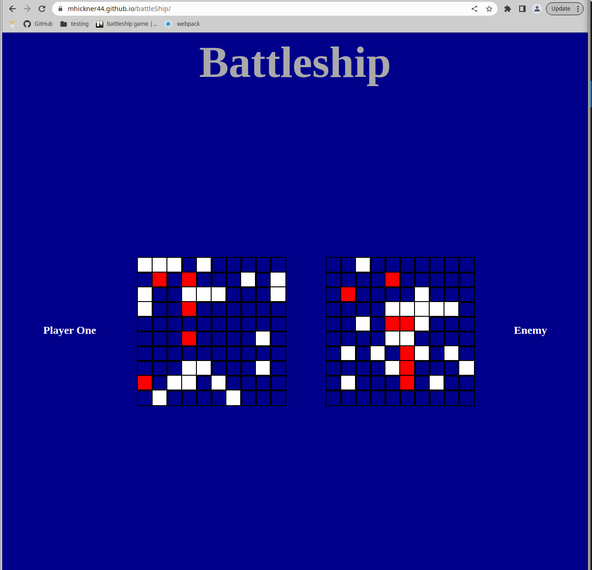

Battlship game built with vanilla javascript ---> [ Click to play the Game!](https://mhickner44.github.io/battleShip/)
 

 ## Purpose 
-learn about testing and using Jest by creating tests for the gameplay methods.

